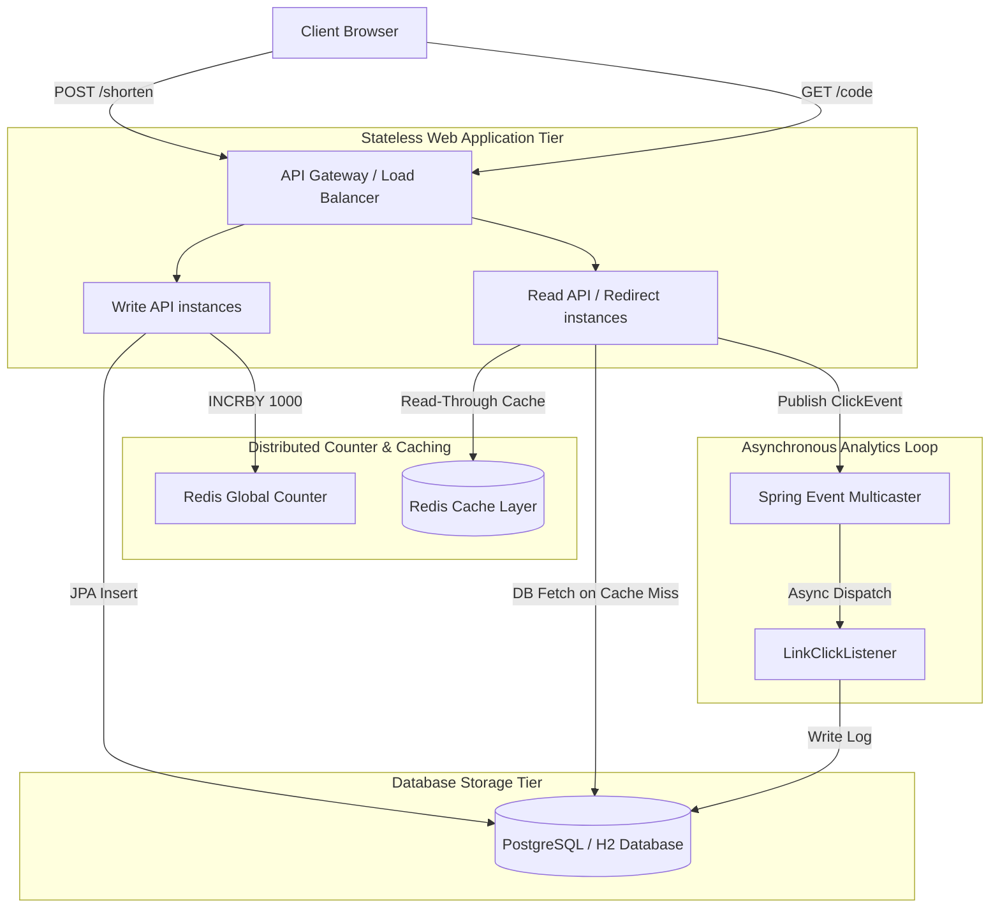

# URL Shortener & Link Analytics Service

A production-grade, high-performance URL Shortener and Link Analytics service built with Spring Boot 3.x and Java 21.

This project is structured specifically to show clean architecture, solid design patterns, and engineering trade-offs suitable for high-scale systems.

---

## Key Features

- **Collision-Free Code Generation**: Utilizes a counter-based bijective encoding system to guarantee short codes never collide, avoiding expensive pre-insertion database lookups.
- **Optimized Write Path**: Pure append strategy that eliminates read queries on shortening.
- **Custom Aliases**: Users can define custom short codes with optimistic concurrency handling via database constraints.
- **Asynchronous Click Analytics**: Logs redirection statistics (IP, user-agent, referrers) in a non-blocking asynchronous event loop to keep redirection latency low.
- **Robust Validation**: Rejects invalid, malformed, or unsafe URLs.
- **Clean Architecture**: Adheres strictly to Domain-Driven Design (DDD) layered patterns.

---

---

## 1. System Requirements

### Functional Requirements
* **URL Shortening**: Accepts a long destination URL and returns a unique, URL-safe short code.
* **Custom Alias**: Optionally accepts a user-defined custom short code (e.g. `paytm-recharge`), validating alphanumeric constraints.
* **Temporary Redirection**: Resolves a short code and redirects (`HTTP 302 Found`) visitors to the original destination URL.
* **Link Click Analytics**: Captures client metrics (IP address, user-agent, referrers, and click timestamp) on redirection.
* **Expiration**: Allows setting optional expiration datetimes for short links.
* **URL Safety Check**: Validates scheme protocols (accepting only `http` and `https`) and rejects self-referential loops pointing back to the service base URL.

### Non-Functional Requirements
* **Low Latency Redirection**: Read paths must redirect visitors under sub-millisecond response times.
* **High Write Throughput**: The system must scale write operations linearly under massive concurrent shortening volumes.
* **Collision-Free Code Generation**: System-generated short codes must be mathematically guaranteed unique under concurrent multi-node writes.
* **Analytical Accuracy**: Redirections must prevent browser caching to capture 100% of redirection metrics.
* **Security & Rate Limiting**: Write endpoints must be protected against API abuse and DDoS attacks.

---

## 2. Capacity Estimation

### A. Traffic Estimates
* **Assumption**: 100 million new URLs shortened per month.
* **Read-to-Write Ratio**: 10:1 (1 billion redirection click-throughs per month).
* **Write Requests Per Second (QPS)**:
  $$\text{Write QPS} = \frac{100,000,000}{30 \times 24 \times 3600} \approx 38.5\text{ requests/sec}$$
* **Read Requests Per Second (QPS)**:
  $$\text{Read QPS} = \frac{1,000,000,000}{30 \times 24 \times 3600} \approx 385\text{ requests/sec}$$
  * *Peak Read QPS* (during spike periods/marketing campaigns): $10 \times \text{Average Read QPS} \approx 3,850\text{ requests/sec}$.

### B. Storage Estimation
* **Average Record size**: 
  * `short_code` (varchar): 10 bytes
  * `long_url` (varchar): 100 bytes
  * `created_at` (timestamp): 8 bytes
  * `expires_at` (timestamp): 8 bytes
  * **Total per mapping**: $\approx 126\text{ bytes}$
* **Monthly Storage Requirement**:
  $$100,000,000 \times 126\text{ bytes} \approx 12.6\text{ GB per month}$$
* **5-Year Storage Size**:
  $$12.6\text{ GB} \times 12 \text{ months} \times 5\text{ years} \approx 756\text{ GB}$$

### C. Caching & Memory Estimation
We assume the Pareto Principle (80% of click traffic hits 20% of hot redirection mappings).
* **Daily Redirection Requests**:
  $$\frac{1,000,000,000}{30} \approx 33.3\text{ million click requests per day}$$
* **Redirections to Cache (20% of daily traffic)**:
  $$33.3\text{ million} \times 0.20 \approx 6.66\text{ million mappings}$$
* **RAM Requirement for Caching Mappings**:
  $$6.66\text{ million} \times 126\text{ bytes} \approx 839.16\text{ MB}$$
  * An extremely compact profile easily accommodated in standard Redis setups.

---

## 3. Design Decisions & Constraints

### A. Pure-Append Write Strategy
Instead of checking if a target `long_url` is already shortened prior to writing (`SELECT short_code FROM url_mappings WHERE long_url = ?`), the system allocates a fresh short code and appends the mapping.
* **Benefits**: 
  1. Turning the write path into a single `INSERT` statement, eliminating lookup disk latency.
  2. Supporting analytics segment tracking—marketing teams need independent short URLs pointing to the same destination (e.g. newsletter campaign vs SMS campaign) to calculate channel metrics.

### B. Bijective Counter Obfuscation
We reject random generation loops (e.g., hash truncation or random string retries) due to write performance degradation under collisions. Instead, we use a sequential sequence counter.
To prevent guessability and enumeration security leaks, the counter is obfuscated using a **62-bit bijective Feistel Cipher** before encoding. Since the cipher is bijective, the mapped output is guaranteed 100% collision-free without database index pre-checks.

### C. HTTP 302 Temporary Redirects
We return `302 Found` rather than `301 Moved Permanently` redirects.
* **Rationale**: Browsers cache 301 redirects locally. Subsequent visitor clicks bypass the server completely, blinding our analytics engine. A 302 redirect ensures every click is captured at the redirection controller.

---

## 4. System Architecture



---


## 5. Low-Level Design (LLD) Patterns

* **Strategy Pattern (`CounterService`)**: Exposes a common API strategy interface. Implements `DatabaseCounterService` (standard relational database sequence) and `RedisCounterService` (atomic segment range allocator). This lets the deployment strategy scale up from single-node local runs to high-concurrency clusters.
* **Observer / Event-Driven Pattern (`LinkClickEvent` & `LinkClickListener`)**: Decouples the controller redirection response thread from database tracking inserts.Redirections are immediately served, and click logs are queued and persisted on background worker threads.
* **Token Bucket Pattern (`TokenBucket` / Interceptor)**: A custom, thread-safe Token Bucket implementation maps client IPs to local buckets inside a thread-safe map, ensuring API protection without adding massive external library loads.
- **Data Transfer Object (DTO) Record Pattern**: Leverages Java 21 `record` classes to represent immutable HTTP payloads (`ShortenRequest`, `ShortenResponse`), ensuring clean API serialization contracts isolated from DB schema concerns.

---

---

## Tech Stack

- **Runtime**: Java 21
- **Framework**: Spring Boot 3.x
- **ORM / Persistence**: Spring Data JPA & Hibernate
- **Databases**:
  - Development/Testing: H2 Database (in-memory)
  - Production: PostgreSQL
- **Caching**: Spring Cache with Redis
- **Testing**: JUnit 5, Mockito, AssertJ

---

## Quickstart

### Prerequisites
- JDK 21
- Maven 3.x

### Build the Project
```bash
./mvnw clean package
```

### Run Tests
```bash
./mvnw clean test
```

### Run the Application Locally (Default Profile: H2 Database)
```bash
./mvnw spring-boot:run
```
The server will start at `http://localhost:8080`.
The H2 database console is available at `http://localhost:8080/h2-console` (JDBC URL: `jdbc:h2:mem:urlshortener`, Username: `sa`, Password: `sa`).

---

## API Endpoints

### 1. Shorten URL
Create a short code for a destination URL.

- **URL**: `POST /api/v1/shorten`
- **Headers**: `Content-Type: application/json`
- **Request Body**:
```json
{
  "longUrl": "https://www.paytm.com/recharge",
  "customAlias": "paytm-recharge"
}
```
- **Response (201 Created)**:
```json
{
  "shortCode": "paytm-recharge",
  "shortUrl": "http://localhost:8080/paytm-recharge",
  "longUrl": "https://www.paytm.com/recharge",
  "createdAt": "2026-07-17T03:30:00Z",
  "expiresAt": null
}
```

### 2. Redirect URL
Redirect to the original long URL.

- **URL**: `GET /{code}`
- **Response**: `302 Found` (Location Header pointing to destination URL).
- **Error Response (404 Not Found)**: If the short code does not exist.

---

### 3. Administrative Retention Cleanup
Deletes short URL mappings and their associated logs if they have been inactive for more than a specified retention window (default: 30 days).

- **URL**: `DELETE /api/v1/admin/cleanup`
- **Query Parameters**:
  - `days` (Optional integer, default: `30`): Retention cutoff duration in days.
- **Response (200 OK)**:
  ```json
  {
    "message": "Database retention cleanup executed successfully.",
    "deletedCount": 42,
    "retentionDays": 30
  }
  ```

---

## 6. Production Automated Retention (Cron Job Setup)

To automatically clean up expired or inactive short codes in a cloud-deployed environment:
1. **Spring `@Scheduled` Cron**: We can annotate a service method with `@Scheduled(cron = "0 0 2 * * ?")` (running daily at 2:00 AM) that calls `urlShortenerService.cleanupInactiveUrls(30)`.
2. **Cloud Cron Scheduler**: Expose this `/api/v1/admin/cleanup` endpoint (secured via API keys / Basic Auth) and trigger it daily using a serverless cron trigger, such as:
   * **AWS EventBridge + Lambda**: Triggers a function that sends a secure DELETE request to `/api/v1/admin/cleanup?days=30`.
   * **Kubernetes CronJob**: Deploys a lightweight curler pod to hit the admin cleanup route periodically.

